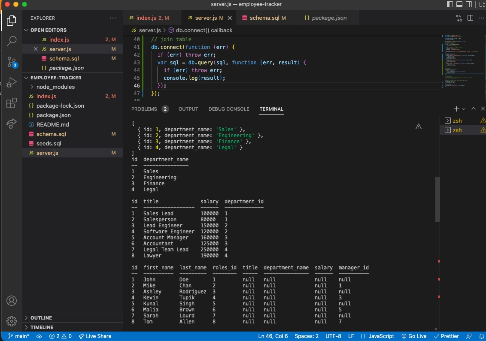

# Employee Tracker

Link to video walk through: [https:/](https:/)

## Description

This is a command-line application from scratch to manage a company's employee database.

The purpose of the app is to provide an interface that allow non-developers to easily view and interact with the information stored in databases, such as a content management system (CMS).

## Installation

This application uses Node.js, Inquirer, and MySQL.

## Preview & Usage

1. Upon run - it will prompt the user which task they would like to work on.
2. Department, roles and employee tables can be viewed.
3. There is also additional prompts to add a role and an employee.

## License

There were no licenses obtained for this project. For more information on licenses, follow this link:
[https://choosealicense.com/](https://choosealicense.com/).
